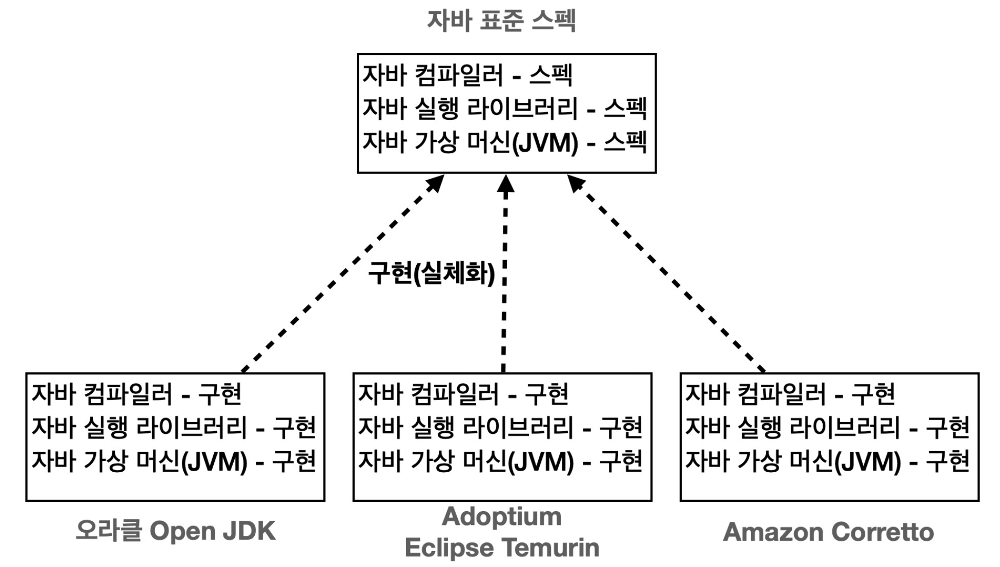
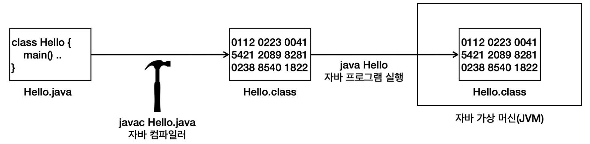
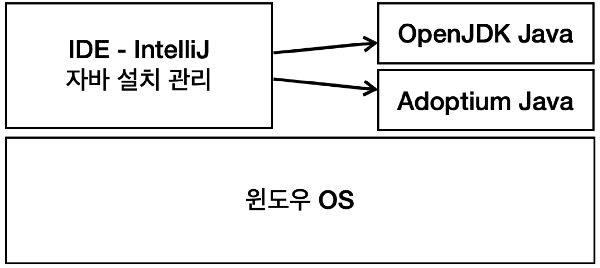
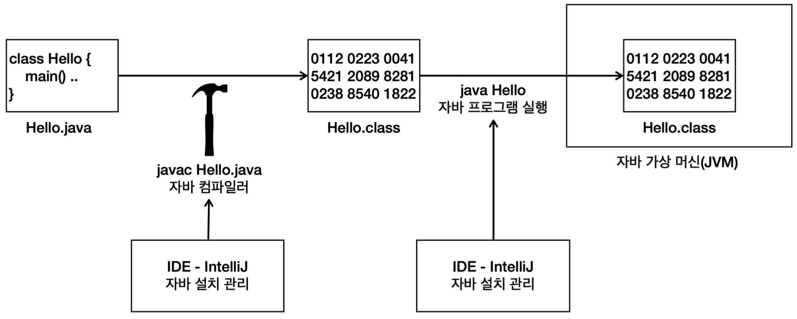
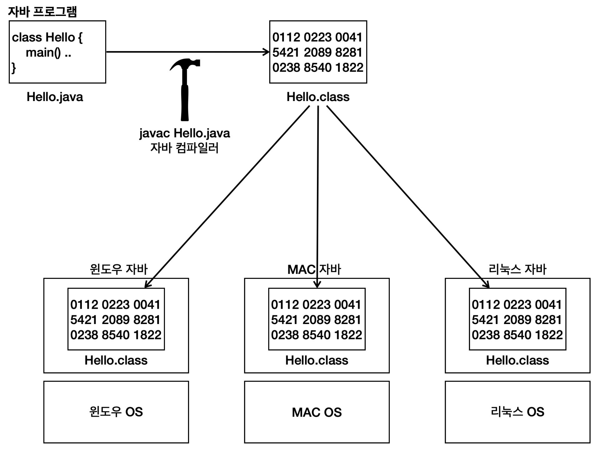
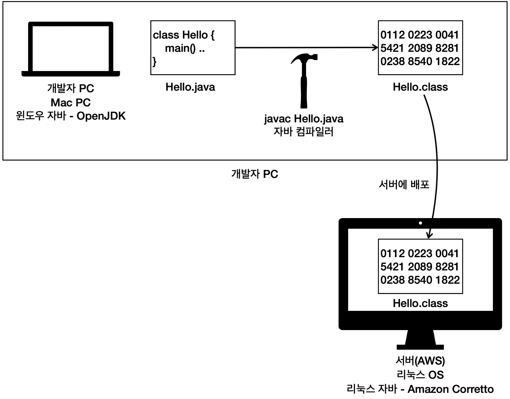

# 자바란?

## 자바 표준 스팩과 구현
자바 표준 스펙: 자바는 이렇게 만들어야 한다는 문서.  
&emsp;자바 커뮤니티 프로세스(JCP)에 의해 관리됨  
 

각각 장단점: 최적화 ... ex) AWS에 최적화 되어있는 Amazon Corretto  

## 컴파일과 실행

.java 파일을 .class 파일로 바꾸어주는 컴파일 단계
- javac 라는 자바 컴파일러를 사용
- 자바 소스코드를 바이트 코드로 변환
- 자바 가상머신에서 더 빠르게 실행될 수 있도록 최적화, 문법 오류 검출

자바 가상 머신에서 실행되며 프로그램 작동  

## IDE 와 자바
인텔리제이를 통한 자바 설치 관리

자바를 OS에 직접 설치해도 되지만, 설치나 환경설정이 번거로움

## 인텔리제이를 통한 자바 컴파일, 실행과정

.java 파일을 .class 파일로 변환하기 위한 javac 프로그램 사용을 IDE-IntelliJ가 자동으로 해줌  
인텔리제이 out 폴더에 가보면 컴파일된 .class 파일이 있음

## 자바와 운영체제 독립성
### 일반적인 프로그램
일반적인 프로그램은 윈도우 프로그램.exe 파일을 윈도우를 제외한 다른 운영체제(MAC OS, Linux 등)에서 사용할 수 없다.  

### 자바 프로그램

자바가 설치된 모든 OS에서 실행 가능하다

## 자바 개발과 운영환경

서버는 주로 리눅스 사용  
운영체제 독립성 덕분에 각각 환경에 맞추어 자바 설치 가능